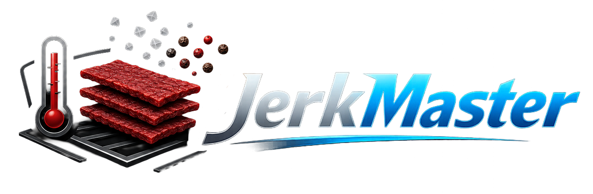
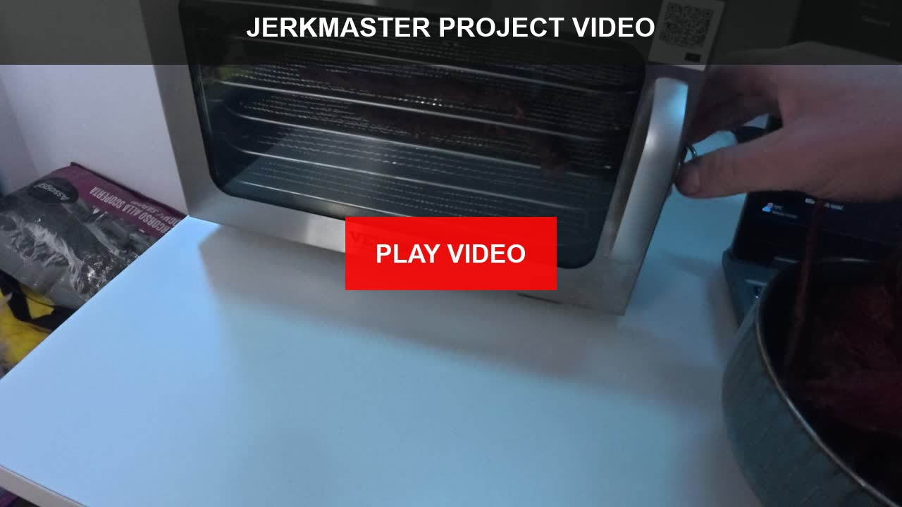
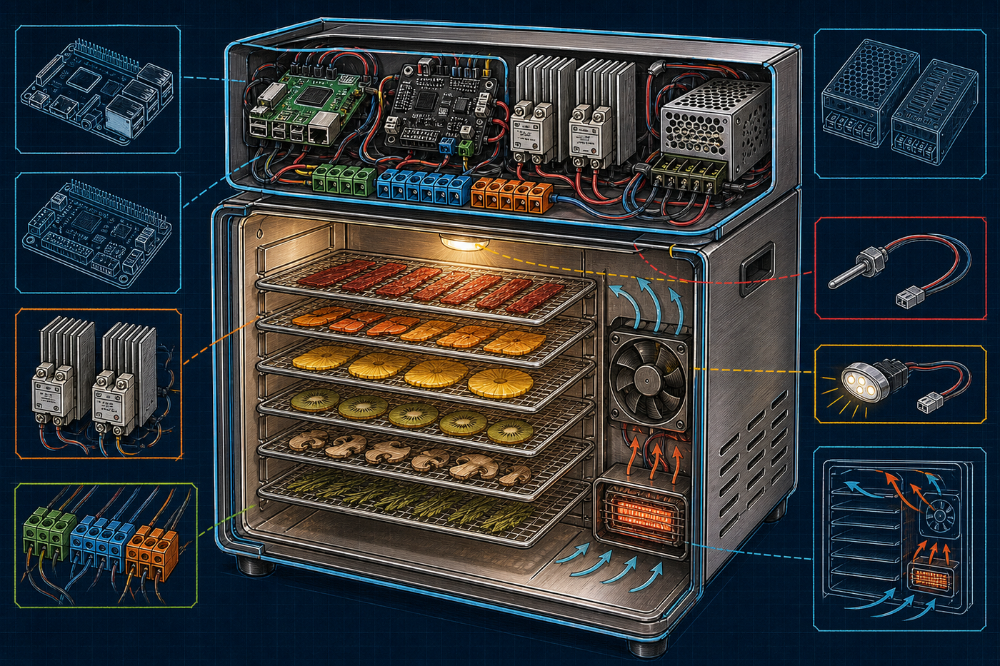
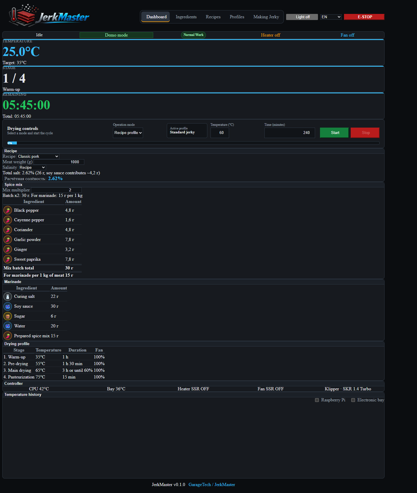

<p align="center">
  
</p>

<p align="center">
  Open-source smart dehydrator control for repeatable jerky making.
</p>

<p align="center">
  <a href="README.md">About</a> |
  <a href="docs/technical-readme.md">Technical overview</a> |
  <a href="docs/build-notes.md">Build notes</a> |
  <a href="docs/about-recipes.md">Recipes</a> |
  <a href="docs/installation.md">Installation</a> |
  <a href="docs/hardware.md">Hardware</a> |
  <a href="docs/wiring.md">Wiring</a> |
  <a href="SECURITY.md">Safety</a>
</p>

# JerkMaster

[](https://youtu.be/LMud8d1dsIs)

JerkMaster is a Raspberry Pi, Klipper, and Moonraker based controller for a
converted food dehydrator. It combines drying profiles, recipe calculations,
live telemetry, safety macros, dual round status displays, sound feedback, and a
Raspberry-hosted web interface.

The current hardware architecture is fixed:

- Raspberry Pi 3B+: web UI, dual GC9A01 displays, MAX98357A sound, and
  shutdown orchestration.
- BTT SKR 1.4 Turbo: heater, fans, thermistors, door switch, button LEDs,
  action button, chamber NeoPixel line, and `PS_ON`.
- BTT Relay V1.2: wake/restart button and final power cut after Raspberry
  shutdown.
- Custom drying mode runs the selected temperature/time, then cools the chamber
  with the fan until 30 C before the ten-minute automatic power-off delay.



## Status

| Item | Status |
|---|---|
| Version | `0.2.1-alpha` |
| Hardware | Current Raspberry/SKR split architecture documented |
| Software | Tested on the working prototype |
| First production drying run | Completed |
| Repository visibility | Public |

`VERSION = 0.2.1`

## Quick Install

Install MainsailOS, flash Klipper firmware for the SKR 1.4 Turbo LPC1769, clone
this repository on the Raspberry Pi, then run:

```bash
sudo ./tools/bootstrap.sh
```

The bootstrap detects the MCU serial, generates Klipper config from templates,
merges Moonraker settings, installs the web/display/sound services, and offers
display and audio tests. Finish with:

```text
RESTART
```

Then complete [Final Hardware Checklist](docs/final-checklist.md) before
connecting mains-powered loads.

## Documentation

- [Installation](docs/installation.md)
- [Final hardware checklist](docs/final-checklist.md)
- [Wiring notes](docs/wiring.md)
- [Hardware overview](docs/hardware.md)
- [Technical overview](docs/technical-readme.md)
- [Build notes and gallery](docs/build-notes.md)
- [Safety policy](SECURITY.md)

## Project Story

JerkMaster grew from a practical jerky-making problem: fixed-time dehydrators do
not make it easy to repeat staged drying profiles, recipe scaling, marinade
math, and batch notes. The project brings those pieces into one controller so a
successful recipe can be repeated months later with the same ingredients, the
same drying profile, and the same result.


