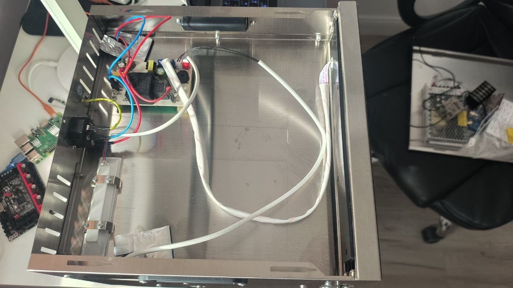
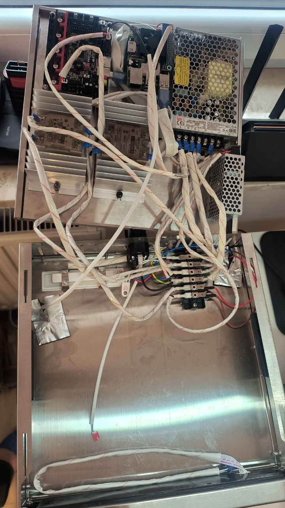
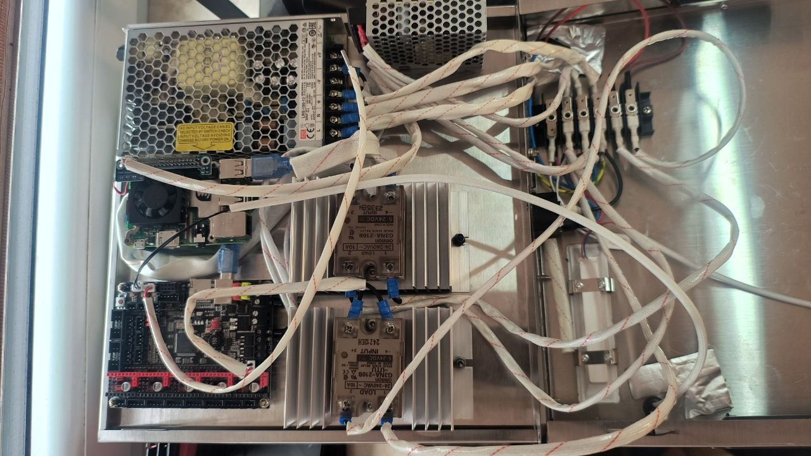
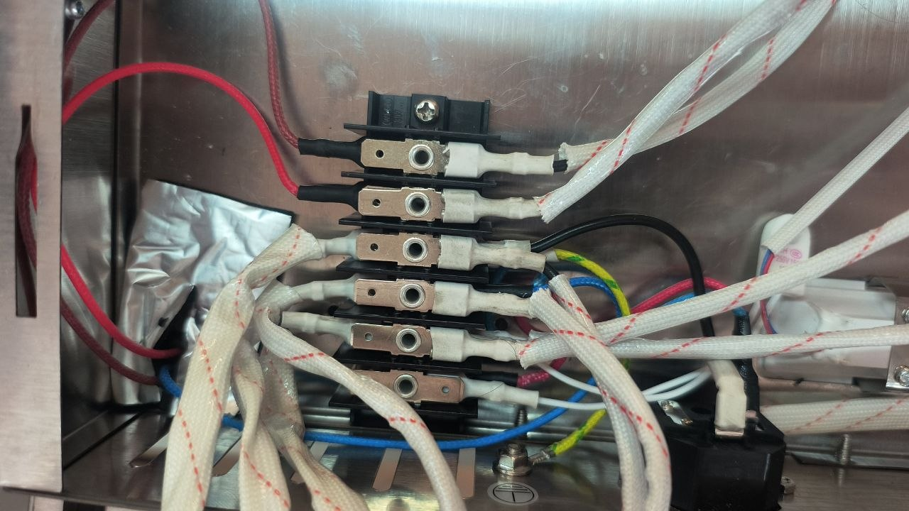
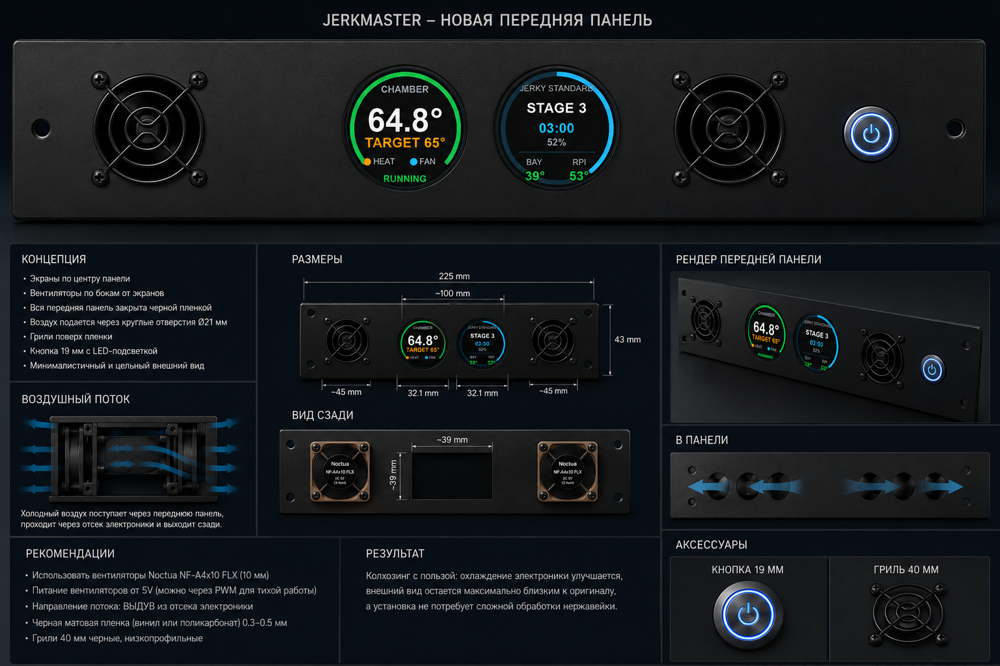
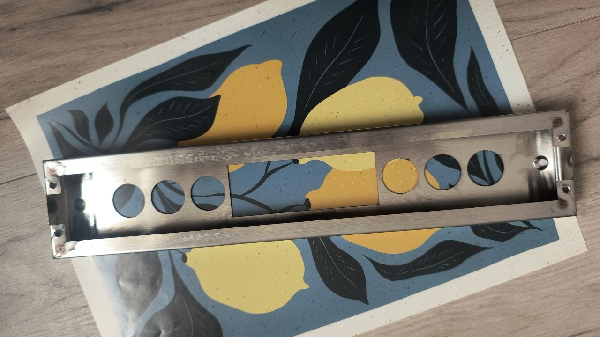
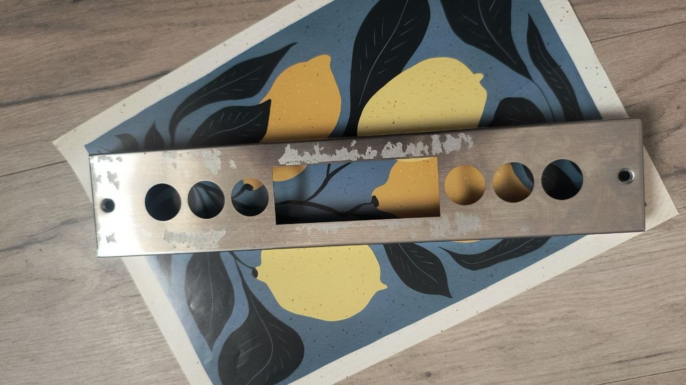
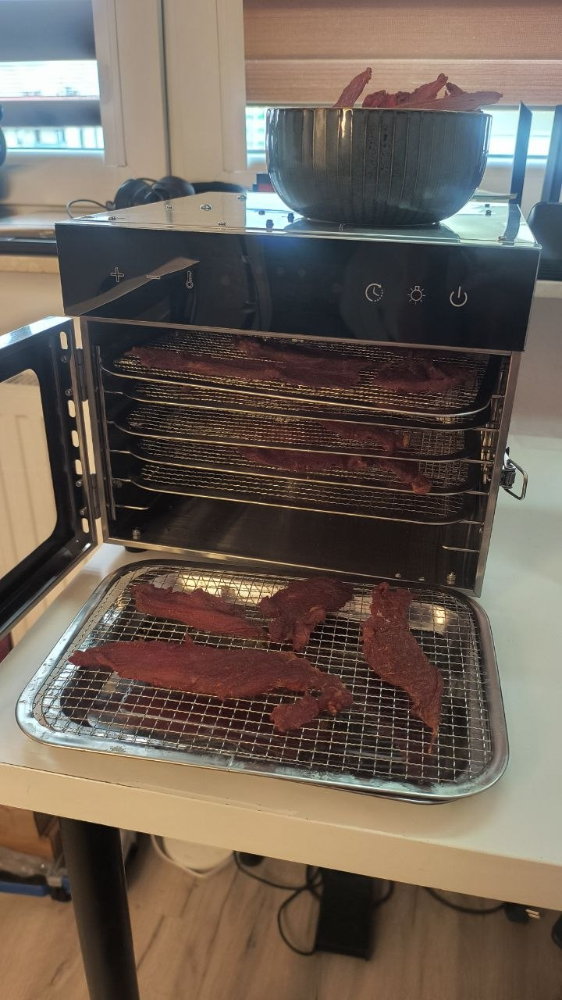
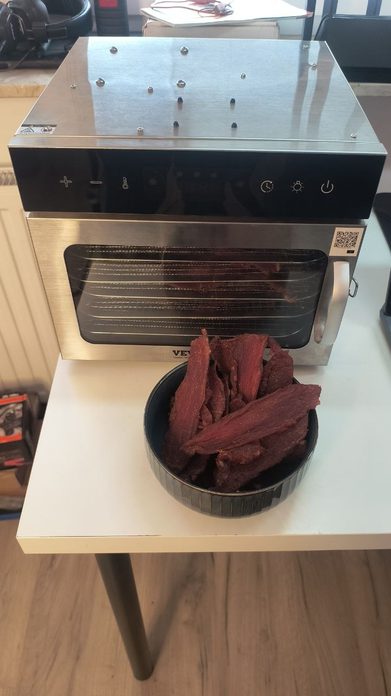
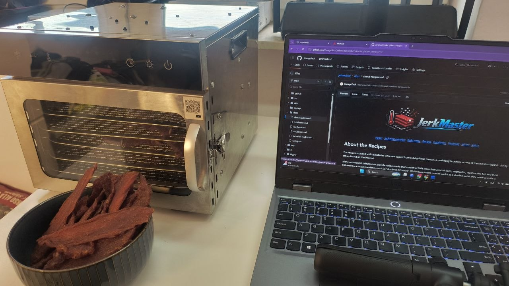

  

  <a href="../README.md">About</a> ·
  <a href="technical-readme.md">Technical overview</a> ·
  <a href="build-notes.md">Build notes</a> ·
  <a href="about-recipes.md">Recipes</a> ·
  <a href="installation.md">Installation</a> ·
  <a href="hardware.md">Hardware</a> ·
  <a href="wiring.md">Wiring</a> ·
  <a href="../SECURITY.md">Safety</a>

# Build Notes

This project did not start with choosing a dehydrator specifically for modification. I originally bought the VEVOR dehydrator for normal use, and only later started modifying it after running into the limitations of the factory controller.

By coincidence, this particular model turned out to be a very good platform for this type of conversion.

VEVOR sells several dehydrators in this line, differing in size, power and number of drying trays. However, they appear to share a very similar layout: a stainless steel drying chamber, rear-mounted fan and heater assembly, and a separate electronics bay located at the top of the unit.

My unit is the smallest model in the range, with 6 trays measuring approximately 20 × 28 cm. In practice, it can hold around 1.2–1.4 kg of meat sliced to about 5 mm thickness.

After briefly looking around, it is clear that many food dehydrators from other manufacturers use a similar construction: a metal box with a rear fan and heater assembly. I believe many of these machines could also be suitable for a similar conversion, as long as they provide enough internal space and a reasonable separation between the drying chamber and the electronics.

One important practical note: the body of this dehydrator is made from thin but very strong stainless steel. Working with it is not as easy as it may seem. Even simple operations such as drilling holes can become surprisingly difficult without proper tools, sharp drill bits, low speed, cutting oil and patience.

As mentioned earlier, my internal hardware build was based partly on components I already had available from previous projects. However, the architecture is flexible. You do not have to use exactly the same hardware. Any controller board supported by Klipper can be used, and you are free to choose your own host controller, SSRs, power supplies, wiring layout and mounting approach.

In other words, use what you already have — especially if, like many DIY and 3D printing enthusiasts, you have old controller boards, power supplies, connectors and other useful parts gathering dust on a shelf.

Regarding SSR heatsinks: in my build I used oversized heatsinks. This was mainly because I was building the project away from my main workshop, where I do not have access to my usual stock of parts. During early testing, the rear wall of the dehydrator became quite hot, so I decided to use large heatsinks from the beginning rather than buy and test several smaller options. It was a conservative choice intended to remove one possible thermal problem from the project.

## Electronics Bay Conversion

The factory electronics bay provided enough space for the Raspberry Pi, SKR
controller, two power supplies, SSRs, heatsinks, and mains distribution. The
photos below show the bay before the conversion and during assembly.

| Original electronics bay | Open converted bay |
|---|---|
|  |  |

The final layout mounts the main electronics to the removable upper panel. This
makes the complete assembly accessible for inspection, but it also makes cable
routing and strain relief especially important.

These are build-progress photographs taken with the appliance disconnected and
opened for inspection. Never operate the dehydrator with exposed mains wiring
or an open electronics enclosure.

| Installed electronics | Barrier terminal wiring |
|---|---|
|  |  |

## Safety Warning

This project involves modifying a mains-powered household appliance with a metal enclosure and 220–240 V AC wiring.

Work carefully and responsibly.

If you do not clearly understand what you are doing, do not attempt this modification yourself. Either abandon the project or ask a qualified electrician to help with the mains wiring, grounding, fusing and safety checks.

Use proper wire, reliable terminals and heat-resistant insulation where required. Pay special attention to wiring near the heater and any high-temperature areas.

Use suitable crimp terminals and a proper crimping tool. Do not crimp electrical terminals with pliers, a vise, a hammer, or anything else that only “looks good enough”. A poor crimp may work for a while, but sooner or later the wire can loosen, pull out, touch the metal case, and create a dangerous failure.

This is not a low-voltage toy project. Treat it like real electrical equipment.

## New Front Panel

The planned front panel replaces the original controls with two centered round
status displays, two continuously powered Noctua cooling fans, and one
momentary 12 V RGB push button.

The original stainless panel has already been stripped and prepared for the new
layout. The rectangular opening and circular cutouts will be covered by the new
front-panel insert.

| Stripped original frame | Prepared front-panel cutouts |
|---|---|
|  |  |

The two fans sit on either side of the displays and provide a direct airflow path
through the electronics bay. They are not software-controlled: whenever the
electronics power supply is on, both fans run. This avoids making controller
cooling dependent on firmware, GPIO state, or a temperature rule.

The momentary button is used to request power through a BTT Power Shutdown Relay
V1.2. Its switch contacts and RGB LED are electrically separate:

- the momentary switch contacts connect only to the relay module's button input;
- the relay module receives mains input continuously and switches the downstream
  electronics supply;
- the blue LED channel is driven from 12 V through the free SKR BED MOSFET
  output;
- the unused LED channels are left disconnected and insulated.

The button is a normal power-control interface, not an emergency stop. It must
not replace the physical E-stop, independent thermal fuse, breaker, protective
earth, or a correctly rated safety contactor where one is required.

## Real-World Use

The converted dehydrator is already used for regular jerky batches while the
hardware and interface continue to evolve.

| Loaded dehydrator and finished tray | Finished jerky |
|---|---|
|  |  |

