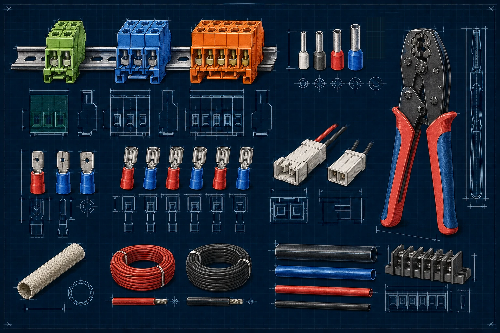
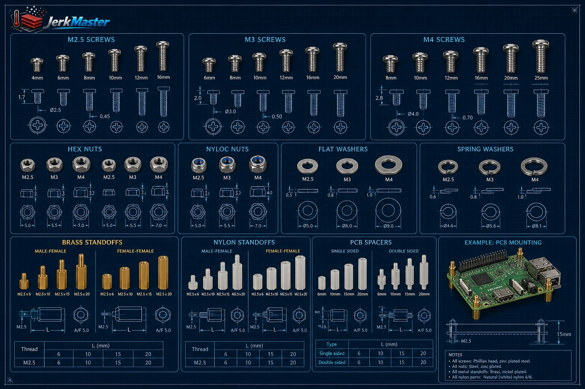

  

  <a href="../README.md">About</a> ·
  <a href="technical-readme.md">Technical overview</a> ·
  <a href="build-notes.md">Build notes</a> ·
  <a href="about-recipes.md">Recipes</a> ·
  <a href="installation.md">Installation</a> ·
  <a href="hardware.md">Hardware</a> ·
  <a href="wiring.md">Wiring</a> ·
  <a href="../SECURITY.md">Safety</a>

# Reference Hardware

The reference JerkMaster `0.2.0-alpha` hardware revision uses the components
below. Equivalent parts can be used only after checking electrical
compatibility, sensor behavior, power requirements, and safety limits.

## Reference Build Brands

## Dehydrator

- VEVOR H6-C001 food dehydrator
- AC 220–240 V, 50 Hz, 400 W
- Reference fan: AC 220 V, approximately 1320 RPM, 660 Ohm
- Reference heater: AC 220 V, 120 Ohm
- Original chamber lighting: 4 pcs 12 V LEDs
- Reference sensor: NTC 100K

## Controller And Compute

- Raspberry Pi 3 Model B+
- BTT SKR 1.4 Turbo
- USB A-to-B host/controller cable
- Two 1.28-inch GC9A01 round status displays on Raspberry Pi SPI0
- MAX98357A I2S amplifier and speaker for Raspberry Pi sound feedback
- JerkMaster chamber-light retrofit: 8x WS2812B NeoPixel line on the SKR NeoPixel connector

## Power

- Mean Well RS-25-5
- Mean Well LRS-150-12
- BTT Power Shutdown Relay V1.2 for normal electronics power control
- Power/wake momentary button wired to BTT Relay RESET
- Action/menu/safe-shutdown momentary button wired to Raspberry Pi GPIO17 / physical pin 11
- Two 12 V-ready button LEDs switched by SKR BED / `P2.5` and HE1 / `P2.4`
- 8x WS2812B NeoPixel LED line for chamber illumination

## Load Switching

- Two Omron G3NA-210B SSRs
  - Heater SSR
  - Circulation-fan SSR
- Appropriately sized SSR heatsinks

## Temperature Sensors

- EPCOS 100K NTC for drying chamber
- EPCOS 100K NTC for electronics bay
- Raspberry Pi SoC temperature sensor
- Normally closed door microswitch wired to SKR `Z-STOP` / `P1.29`

## Cooling

- Waveshare PI-FAN-3007 or equivalent Raspberry Pi cooling
- 2 pcs Noctua NF-A4x10 FLX electronics-bay cooling fans connected to SKR `FAN1` and `FAN3`

These Noctua fans cool the electronics bay, not the drying chamber. Verify the
selected supply rail, connector polarity, and startup current before applying
power.

## AC Distribution
- Weco 3070-PCM/03-5.033 wecoconnectors.com

## Required Safety Components

- Independent 115°C thermal fuse, correctly rated for the heater circuit
- Protective earth
- Correctly rated breaker or fuse
- Physical emergency stop
- Closed non-combustible electronics enclosure
- Correctly rated wiring, ferrules, terminals, insulation sleeves, and strain relief

## Materials Used In The Reference Build

The electrical connection sheet shows one example of each Faston terminal type, insulated ring terminals with different ring sizes, a single black six-position barrier terminal strip, ferrules, wiring and insulation supplies.

The Pro'sKit 6PK-301H ratcheting crimper accepts interchangeable dies. Use the CP-236DR die for insulated terminals, the 1PK-3003D2 die for non-insulated Faston terminals, and the CP-236DE die for bootlace ferrules.

The fastener sheet shows the common screw sizes, nuts, washers, PCB spacers and male-female or female-female standoffs used when mounting controller boards and power electronics.

- M2.5/M3 standoffs
- M2.5/M3/M4 fasteners
- Fiberglass insulation sleeve d4/6/12 mm
- JST-XH 2 pin connectors
- Insulated Faston terminals 4.8/6.3
- Bootlace ferrules 0.5-1.0 mm2
- Ring terminals blue/red
- Wire 0.5-1.0 mm2
- Heat Shrink Tube
- Thermal paste
- Locktite

## Manufacturer Note

The reference build uses hardware from VEVOR, Raspberry Pi, BTT, Omron, Mean Well, Waveshare, Weco and other manufacturers. None of these companies sponsor or endorse JerkMaster. Their products were selected because they were available and useful. Friendly sponsorship conversations are welcome.
