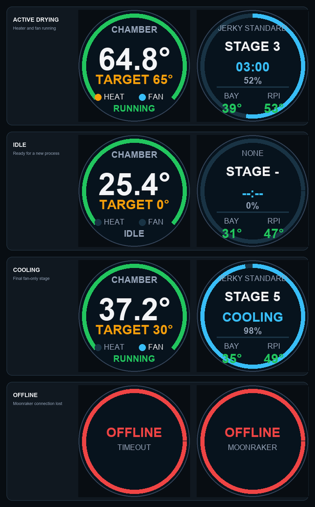
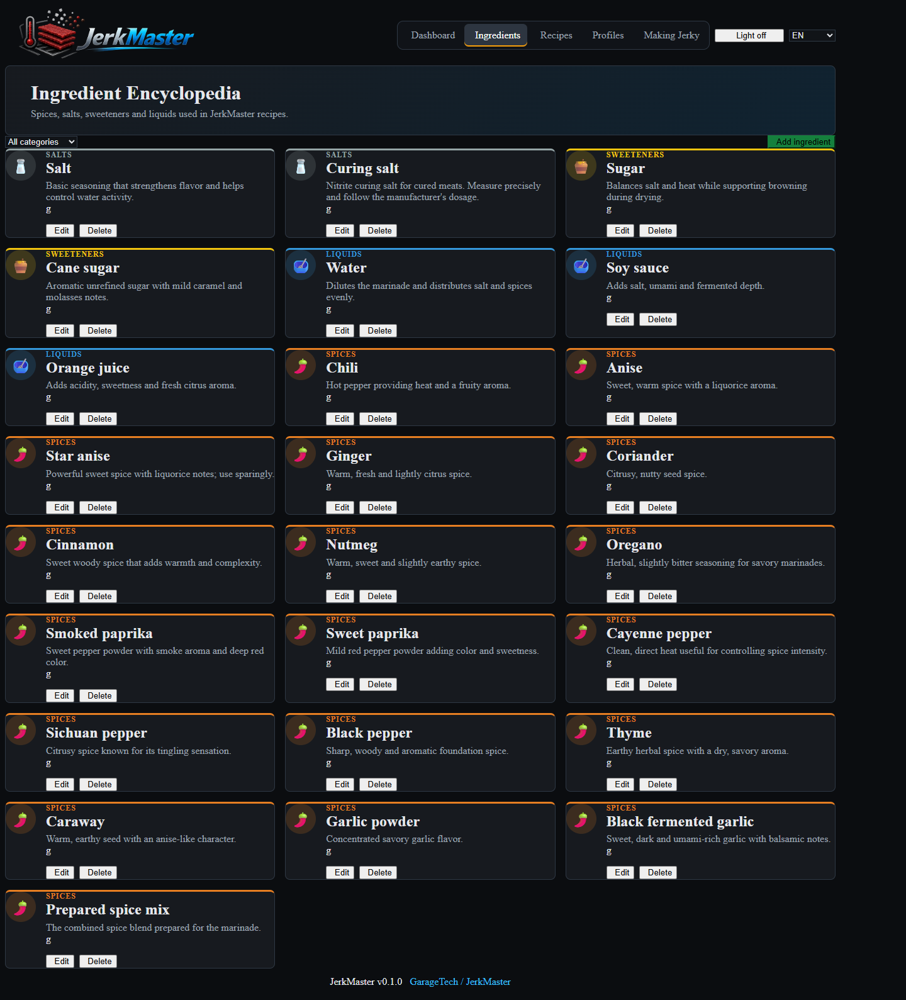
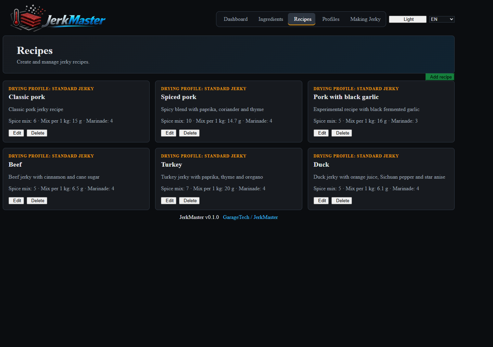
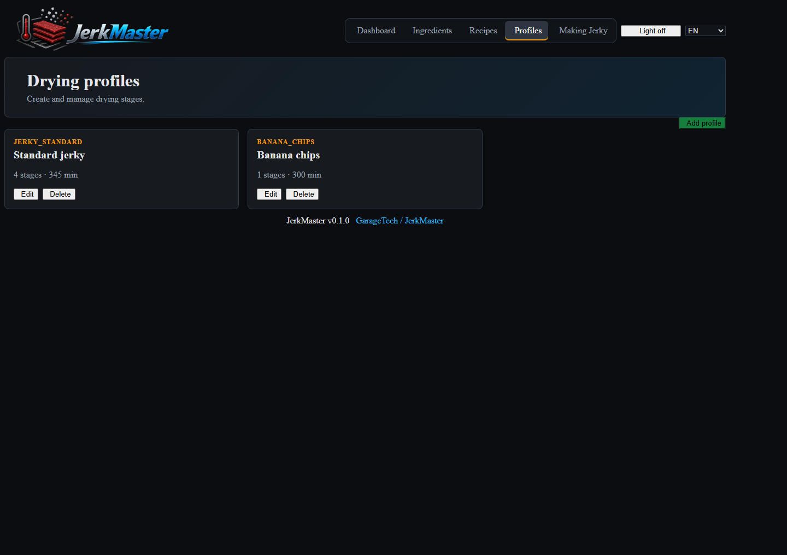
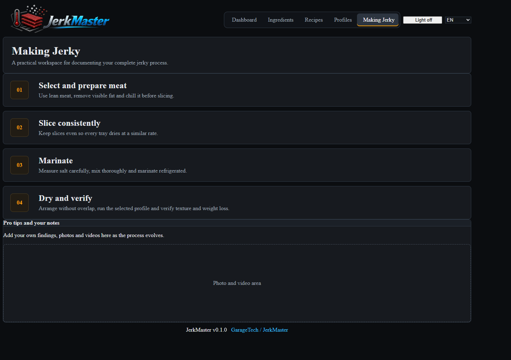

<p align="center">
  
</p>

<p align="center">
  An open-source smart dehydrator controller for repeatable jerky, fruit, and vegetable drying.
</p>

<p align="center">
  <a href="../README.md">About</a> ·
  <a href="technical-readme.md">Technical overview</a> ·
  <a href="build-notes.md">Build notes</a> ·
  <a href="about-recipes.md">Recipes</a> ·
  <a href="installation.md">Installation</a> ·
  <a href="hardware.md">Hardware</a> ·
  <a href="wiring.md">Wiring</a> ·
  <a href="../SECURITY.md">Safety</a>
</p>

# Technical Overview

JerkMaster turns a conventional food dehydrator into a programmable, monitored drying system. It combines a Raspberry Pi, Klipper, Moonraker, a BTT SKR controller, temperature sensors, and SSR-controlled loads with a browser-based control panel.

The project was built around a modified VEVOR dehydrator, but the software and configuration can be adapted to other machines after checking their electrical design, sensors, loads, and safety limits.


## Highlights

- Multi-stage drying profiles with temperature, duration, fan-on stages, and displayed target weight-loss guidance.
- Custom one-shot drying mode: choose temperature and time, then start.
- Recipe calculator scaled by meat weight.
- Explicit spice-mix dosage per kilogram of meat.
- Salinity presets with soy-sauce salt contribution.
- Ingredient encyclopedia with multilingual names and descriptions.
- CRUD management for ingredients, recipes, and drying profiles.
- Protection against deleting ingredients or profiles that are still in use.
- English, Russian, and Ukrainian interface.
- Live chamber, electronics-bay, and Raspberry Pi temperatures.
- Temperature history chart.
- Moonraker and Klipper integration.
- Emergency-stop command.
- Diagnostic status reporting.
- SKR-owned button LED effects for ready, running, complete, door-open, emergency, and shutdown states.
- Door-open handling that pauses the active drying stage, turns the heater off, switches the chamber light on, updates the round displays, and plays an audio cue.
- MAX98357A sound cues driven by the Raspberry Pi display service.
- Demo mode for testing the interface without connected hardware.
- Responsive browser UI with no build step.

## Hardware Used In The Reference Build

- VEVOR H6-C001 food dehydrator
- Raspberry Pi 3 Model B+
- BTT SKR 1.4 Turbo
- Omron G3NA-210B SSRs for heater and circulation fan
- EPCOS 100K NTC sensors for chamber and electronics bay
- Mean Well power supplies
- Two GC9A01 round status displays
- MAX98357A I2S audio amplifier and speaker
- BTT Power Shutdown Relay V1.2
- Two illuminated front-panel buttons and a normally closed door microswitch
- 8x WS2812B NeoPixel chamber-light line
- 2 pcs Noctua NF-A4x10 FLX electronics-bay cooling fans on SKR FAN1 and FAN3
- Independent thermal fuse, protective earth, breaker, and physical emergency stop

VEVOR, Raspberry Pi, BTT, Omron, Mean Well, and the other manufacturers mentioned here are not sponsors or affiliates of this project. Their hardware was simply useful for the build.

## Software Architecture

| Layer | Responsibility |
|---|---|
| Browser UI | Dashboard, calculators, CRUD editors, translations, telemetry, diagnostics |
| Moonraker | HTTP API between the browser and Klipper |
| Klipper | Heater/fan control, sensors, button LEDs, door/action inputs, PS_ON, safety limits, and non-blocking drying macros |
| Klipper `DRYER_STATE` | Authoritative active recipe, profile, stage, settings, and elapsed time |
| Raspberry user-data files | User-created and edited ingredients, recipes, and profiles shared by every browser |
| Browser local storage | Language preference for that browser |
| JSON files | Default ingredients, recipes, profiles, categories, and translations |

The UI is plain HTML, CSS, and JavaScript served on the Raspberry Pi by
`jerkmaster.service`. The service disables browser caching and exposes `/health`
for installation checks. Default project data remains in the repository. User
edits are stored separately in `/var/lib/jerkmaster/user-data/`, survive
interface updates, and are shared by every browser connected to the Raspberry
Pi. Existing browser-local catalog changes are intentionally not migrated.
Active drying state is never restored from browser storage; Klipper is the only
source of truth.

### Software Stack


### Round Status Displays

The dual GC9A01 displays show chamber temperature, process progress, branding,
animated eyes, and process scenes. The Raspberry Pi display service also plays
MAX98357A sound cues for startup, beer scene, game/action feedback, and shutdown.



## Interface Tour

The dashboard combines process control, telemetry, diagnostics, recipe scaling, salinity calculations and the active drying profile.

| Ingredient encyclopedia | Recipe management |
|---|---|
|  |  |

| Drying profiles | Making jerky workspace |
|---|---|
|  |  |

## Quick Start

### Interface Demo

After installing JerkMaster on the Raspberry Pi, open:

```text
http://jerkmaster.local:8080/?demo=1
```

Use `?lang=en`, `?lang=ru`, or `?lang=ua` to choose a language.

### Hardware Installation

1. Read [the installation guide](installation.md).
2. Review [the hardware list](hardware.md) and [wiring notes](wiring.md).
3. Copy and adapt the files from `../klipper/`.
4. Use the credential-free public archive updater from the [installation guide](installation.md) to install and start the UI.
5. Verify every pin, sensor type, temperature limit, and electrical protection device.
6. Test with mains-powered loads physically disconnected.
7. Connect the UI to Moonraker only after the controller is operating safely.

## Moonraker Connection

By default, the UI connects to port `7125` on the same hostname:

```text
http://<current-host>:7125
```

The interface intentionally does not support an alternate Moonraker URL. The web
interface and Moonraker run on the same Raspberry Pi.

Do not expose Moonraker directly to the public internet. Use a trusted LAN or VPN.

## Klipper Commands

```gcode
START_DRYING PROFILE=JERKY_STANDARD RECIPE=pork_classic
START_DRYING PROFILE=BANANA_CHIPS RECIPE=banana_chips
START_DRYING PROFILE=CUSTOM TEMP=60 MINUTES=240 RECIPE=pork_classic
STOP_DRYING
DRYER_ESTOP
```

## Safety

This project controls mains-powered heating equipment. Software is not a substitute for electrical protection.

- Use a qualified electrician for mains wiring.
- Install an independent thermal fuse in series with the heater.
- Use protective earth, correctly rated breakers/fuses, proper enclosures, and a physical emergency stop.
- Assume an SSR can fail closed.
- Never rely on the web UI or software E-stop as the only safety mechanism.
- Verify all configuration values against the actual hardware before energizing loads.

See [SECURITY.md](../SECURITY.md) for reporting software vulnerabilities.

## Project Structure

```text
css/           Interface styles
data/          Default ingredients, categories, and profiles
docs/          Hardware, installation, and wiring notes
img/           Project logo
js/            UI, storage, calculation, telemetry, and diagnostics
klipper/       Klipper, Moonraker, macros, and example G-code
recipes/       Default recipe data
translations/  EN, RU, and UA dictionaries
tools/         Raspberry Pi web-interface and display installers
```

## Contributing

Contributions, hardware adaptations, recipes, translations, testing, and safety reviews are welcome. Read [CONTRIBUTING.md](../CONTRIBUTING.md) before opening a pull request.

## License

JerkMaster is released under the [GNU General Public License v3.0](../LICENSE).

Project home: [github.com/GarageTech/jerkmaster](https://github.com/GarageTech/jerkmaster)
